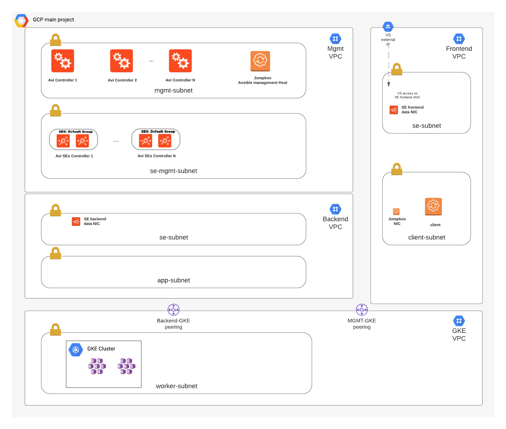

# nostalgic-swartz - VMware NSX Advanced Load Balancer by Avi Networks on top of GCP infrastructure using Terraform + Ansible.

## Overview
Framework for deploying infrastructure on GCP leverages Terraform, which includes the creation of VPC networking components as well as VM instances for the Avi controller and a Jumpbox for testing/management. Ansible is used to configure Avi, including the basic system settings and creating a GCP cloud on a two-arm config mode. For more details please refer to the following articles:

https://avinetworks.com/docs/20.1/gcp-full-access-deployment-guide/
https://avinetworks.com/docs/20.1/configuring-gcp-cloud-network/

## Requirements
* Terraform 0.12.10 or later
* Ansible 2.6 or later
* Access keys to GCP
* Avi Controller Image (20.1.X) created on GCP   https://avinetworks.com/docs/20.1/gcp-full-access-deployment-guide/#upload
